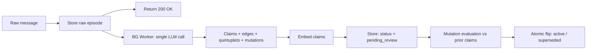

# Whimsync v1 — Cognitive Memory & Context Layer for AI

> **Fast, explainable, multi-tenant AI memory with real storage tiering and citation-backed claims.**

[]()
[]()
[-blue.svg)]()
[]()
[]()

---

## ⚡ Overview & Design Goals

Whimsync v1 is a stateful, explainable memory and context layer designed for AI assistants, coding agents, and multi-tenant applications.

### Core Design Goals
- **Fast ingestion, single LLM understanding call:** Ingest messages instantly and perform single-call extraction of claims, relationship edges, entity quintuplets, and mutations.
- **Accurate relationship classification:** Build structured relationship graphs (`UPDATES`, `EXTENDS`, `SUPPORTS`, `CONTRADICTS`, `DERIVES`, `MENTIONS`) between claims and entities.
- **Real storage tiering (Hot / Warm / Cold):** Query active memory inline from Postgres (`Hot`), filter superseded/expired claims cleanly (`Warm`), and archive audit logs to object storage (`Cold`).
- **Explainable, citation-backed memory:** Every extracted claim links directly to immutable character offsets in raw source `episodes` via authoritative `evidence` rows.
- **Multi-tenant (personal + enterprise) support from day one:** Enforce a unified org-and-namespace access control contract (`Every account is an org`).

---

## 🔐 Scoping & Access Control Contract

Every account is an **organization (`tenant_id`)**. Solo users receive an auto-provisioned personal org where they are the sole `admin`. Multi-member teams operate under the exact same contract.

### Field Contract
| Field | Nullable? | Default if omitted | Job |
|---|---|---|---|
| `tenant_id` | No | None (Explicit) | **Security boundary.** Every claim belongs to exactly one org. |
| `namespace` | **No** | `"default"` | **Isolation & ACL boundary.** Access rules and permissions are scoped per namespace. |
| `user_id` | No | None (Explicit) | **Authorship.** Identifies the creator of the claim. |
| `entity_key` | **Yes** | None | Scoping tag for a domain subject (e.g., `customer:123`). |
| `session_id` | **Yes** | None | Lifecycle tag for temporary or session-bounded claims. |

- **Authentication:** **Google Sign-In (OAuth 2.0 / OIDC)**. First-time sign-in auto-provisions an `org` (`tenant_id`), assigns `role: owner`, and creates the `"default"` namespace.

---

## 🏗️ Architecture & Storage Tiers

### Single-Call Extraction Pipeline


### Storage Tiering
| Tier | Purpose & Query Behavior | Backing Store |
|---|---|---|
| **Hot** | **Default query scope.** Active memory claims, recent episodes, and live relationship graphs. | Postgres + `pgvector` |
| **Warm** | **Excluded from default queries.** Superseded claims, expired session facts, and inactive scopes retrievable via explicit index filters. | Same Postgres database |
| **Cold** | **Offline / Archive storage.** Historical snapshots and compliance exports offloaded physically from Postgres. | S3-Compatible Object Store (MinIO self-hosted; R2 / S3 cloud) |

---

## 🛠️ Technology Stack

- **Language & Runtime:** TypeScript on Bun
- **API HTTP Layer:** Hono
- **Frontend Dashboard:** Next.js (React)
- **Primary Database:** PostgreSQL + `pgvector`
- **Queue & Worker Engine:** Redis + BullMQ
- **Cold Storage:** MinIO (local) / Cloudflare R2 or AWS S3 (cloud)

---

## 🚀 Quick Start (Self-Hosted Architecture)

The self-hosted environment runs out-of-the-box with zero external dependencies via a single `docker-compose.yml`.

```bash
# Clone repository
git clone https://github.com/AdnanQuazi/whimsync.git
cd whimsync

# Launch self-hosted stack (App API, Background Worker, Postgres + pgvector, Redis, MinIO)
docker compose up -d
```

### Services Included in `docker-compose.yml`:
- `app`: Local Hono API server for synchronous ingestion and retrieval.
- `worker`: Dedicated BullMQ background consumer process for LLM extraction and mutations.
- `postgres`: PostgreSQL container pre-loaded with `pgvector`.
- `redis`: Redis container powering BullMQ asynchronous queues.
- `minio`: S3-compatible local object storage container for cold archives.

---

## 📚 Documentation
- **[WHIMSYNC.md](./WHIMSYNC.md):** Canonical v1 Master Architectural Blueprint.
- **[PROGRESS.md](./PROGRESS.md):** Development Roadmap & Milestone Tracker.
- **[.agents/AGENTS.md](./.agents/AGENTS.md):** Agent Commandments & Coding Standards.
