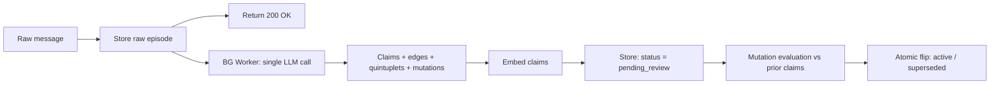

# Whimsync v1 — Cognitive Memory & Context Layer for AI

> **Fast, explainable, multi-tenant AI memory with single-call extraction and citation-backed claims.**

[]()
[]()
[-blue.svg)]()
[]()
[]()

---

## ⚡ Overview & Design Goals

Whimsync is a stateful, explainable memory and context layer designed for AI assistants, coding agents, and multi-tenant applications.

### Core Design Goals
- **Fast ingestion, single LLM understanding call:** Ingest messages instantly and perform single-call extraction of claims, relationship edges, entity quintuplets, and mutations.
- **Accurate relationship classification:** Build structured relationship graphs (`UPDATES`, `EXTENDS`, `SUPPORTS`, `CONTRADICTS`, `DERIVES`, `MENTIONS`) between claims and entities.
- **Real storage tiering (Hot / Warm / Cold):** Query active memory inline from Postgres (`Hot`), filter superseded/expired claims cleanly (`Warm`), and archive audit logs to object storage (`Cold`).
- **Explainable, citation-backed memory:** Every extracted claim links directly to immutable character offsets in raw source `episodes` via authoritative `evidence` rows.
- **Multi-tenant (personal + enterprise) support from day one:** Enforce a unified org-and-namespace access control contract (`Every account is an org`).

---

## 🏗️ Architecture & Pipeline



---

## 🛠️ Technology Stack

- **Language & Runtime:** TypeScript on Bun
- **API HTTP Layer:** Hono
- **Frontend Dashboard:** Next.js (React)
- **Primary Database:** PostgreSQL + `pgvector`
- **Queue & Worker Engine:** Redis + BullMQ
- **Cold Storage:** MinIO (local) / Cloudflare R2 or AWS S3 (cloud)

---

## 🚀 Quick Start (Local Development)

### 1. Prerequisites
Ensure you have [Bun](https://bun.sh/) and [Docker](https://www.docker.com/) installed.

### 2. Launch Local Infrastructure
Start local PostgreSQL (`pgvector`), Redis, and MinIO containers in the background:
```bash
docker compose up -d
```

### 3. Install Workspace Dependencies
```bash
bun install
```

### 4. Start Development Servers
Run the Hono API server (`apps/api`) in development mode with hot reload:
```bash
bun run dev:api
```
The API server will run locally at `http://localhost:3000`.

---

## 📚 Documentation
- **[WHIMSYNC.md](./WHIMSYNC.md):** Canonical v1 Master Architectural Blueprint.
- **[PROGRESS.md](./PROGRESS.md):** Development Roadmap & Milestone Tracker.
- **[.agents/AGENTS.md](./.agents/AGENTS.md):** Agent Commandments & Coding Standards.
