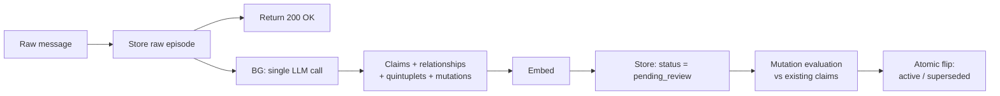
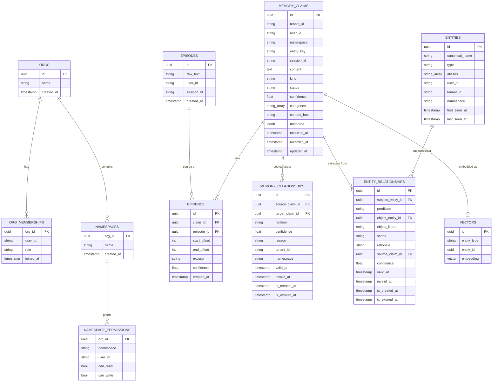

# Whimsync v1

## Design goals

- Fast ingestion, single LLM understanding call
- Accurate relationship classification
- Real storage tiering (hot / warm / cold)
- Explainable, citation-backed memory
- Multi-tenant (personal + enterprise) support from day one

---

## 1. Scoping & access control model

**Every account is an org.** Signup auto-provisions a personal org (the user is its sole `admin`). Joining a company later means membership in a second org. There is no separate "personal account" code path — a solo user's org just happens to have one member. This is the single mechanism, used everywhere.

### Field contract

`Nullable` = schema-level constraint (can this column ever be empty). `Default` = what gets written if the caller omits it. These are independent — a field can be required *and* have a default. Order below is top-down for readability (`tenant → namespace → author`), not a physical nesting — every field is still an independent, flat, indexed column.

| Field | Nullable? | Default if omitted | Job |
|---|---|---|---|
| `tenant_id` | No | none — must be explicit | **Security boundary.** Every claim belongs to exactly one org, always. |
| `namespace` | **No** | `"default"` | **The real access-control + isolation unit.** Memories can't exist outside a namespace; the default value exists purely for caller convenience, the column is never empty. |
| `user_id` | No | none — must be explicit | **Authorship only.** States who/what created the claim. Does not gate access by itself. |
| `entity_key` | **Yes** | none | Dev-facing scoping tag for a subject, e.g. `customer:123`. Genuinely absent is a valid state — not every claim is about a tracked subject. |
| `session_id` | **Yes** | none | Lifecycle tag. Genuinely absent is valid — not every interaction is session-bounded. |

**Validation rule:** `entity_key` without `namespace` is rejected or coerced to `namespace="default"`.

**Retrieval default:** narrowest supplied field wins, gated first by whether the requesting `user_id` has `read` on that `namespace` at all.

### Org membership & namespace permissions

| Table | Fields |
|---|---|
| `orgs` | `id` (= `tenant_id`), `name`, `created_at` |
| `org_memberships` | `org_id`, `user_id`, `role` (`admin`\|`member`), `joined_at` |
| `namespaces` | `org_id`, `name`, `created_at` |
| `namespace_permissions` | `org_id`, `namespace`, `user_id`, `can_read`, `can_write` |

**Access rules:**
- `role: owner` → exactly one per org, always. The creator is Owner at signup. Full control including irreversible org-level actions: delete the org, transfer ownership, change billing/plan, override or demote any Admin. An org must always have exactly one Owner — leaving requires transferring ownership first (or deleting the org, if solo).
- `role: admin` → full read/write on every namespace in the org, automatically. No ACL rows needed; the check is bypassed entirely. Can manage members (invite, remove, promote/demote to Admin) and create namespaces if org policy allows. Cannot delete the org, change billing, or remove/demote the Owner.
- `role: member` → **default-deny.** Zero namespace access until an admin explicitly grants rows in `namespace_permissions`. A member can be granted full access (every namespace) or restricted per-namespace read/write. No org- or membership-management capability.
- A personal org has exactly one member (its creator, `admin`), so every namespace inside it is private by construction — no special-case flag needed. Privacy in a multi-member org works the same way: create a namespace only specific members have access to.
- Namespaces a member has no `read` access to are simply **hidden** — not listed, not discoverable, no partial-visibility state to reason about. Simpler than a separate discoverability flag; revisit only if a concrete "request access to something you know exists" need shows up.

**Namespace creation:**

| Question | Rule |
|---|---|
| Who can create a namespace? | Org setting, default `admins_only` |
| What does the creator get? | Auto-granted `can_read: true, can_write: true` |
| What do members get by default? | Nothing — explicit grant required |

**No cross-namespace relationships.** `memory_relationships` and `entity_relationships` edges only ever connect claims within the same namespace. A namespace is the isolation boundary; an edge crossing it would leak the existence of a claim into a scope the requester may not have access to, even without exposing its content. Extraction simply never proposes cross-namespace edges.

**Conversation vs. session vs. user memory (lifetime framing, not separate stores):**

| Layer | Where it lives | Lifetime |
|---|---|---|
| Conversation | Not stored — the raw in-flight buffer before extraction runs | Single turn |
| Session | A claim tagged with `session_id` | Minutes–hours, expires unless promoted |
| User / Org | A claim in a namespace, `session_id` null | Persists indefinitely; visibility governed entirely by namespace permissions |

---

## 2. Extraction & storage pipeline

**Single LLM call produces, in one structured response:**
- New memory claims (content, kind, confidence)
- `memory_relationships` edges between claims (UPDATES, EXTENDS, SUPPORTS, CONTRADICTS, DERIVES, MENTIONS)
- `entity_relationships` quintuplets (subject, predicate, object, scope, rationale)
- Proposed mutations against candidate prior claims (update / delete / noop)

**Why a single call, not split extraction/mutation:** mutation evaluation needs candidate prior claims, and candidate retrieval uses hybrid search (vector + FTS + entity_key + recency) on the **raw episode**, which happens *before* the LLM call using already-existing indices — not on the new claim's own embedding, which doesn't exist yet. So there's no ordering problem: fetch candidates from the episode → one call proposes claims + edges + quintuplets + mutations against those candidates together → embed the new claims afterward, purely for future retrieval. A split two-call design is a legitimate later experiment if single-call mutation accuracy proves unreliable in practice, but not worth building speculatively now.

**Why `pending_review` matters:** writing a new claim as immediately `active` before mutation evaluation runs creates a window where the new claim and the stale claim it's about to supersede are both retrievable — a live query could return a contradiction. `pending_review` claims are durably written (nothing is lost on a worker crash) but never surfaced to retrieval until the mutation-evaluation transaction resolves and atomically flips both the new claim to `active` and the superseded claim to `superseded`.

**Episodes vs. evidence:** `episodes` is the raw material — one immutable row per ingested message/document, existing independent of whether anything was ever extracted from it (plenty of episodes produce zero claims). `evidence` is the citation trail — a join row linking a specific claim to a specific offset range in a specific episode. Many-to-many: one claim can cite several episodes, one episode can support several claims.

---

## 3. Data schema

### Notes on key tables

- **`memory_relationships`** — governs claim-to-claim lifecycle (how understanding evolved). `tenant_id`/`namespace` are denormalized onto the edge for cheap access-filtered traversal (avoids a join back to claims on every graph query). Both endpoints always share the same `namespace` — no cross-namespace edges.
- **`entity_relationships` (quintuplets)** — subject, predicate, object, scope, rationale. Governs semantic fact structure (what is actually known about how X relates to Y), extracted from claim content, distinct from claim lifecycle. Same no-cross-namespace rule applies.
- **`entities`** — Deduplication is strictly enforced at the database level via a unique index on `(tenant_id, namespace, canonical_name)`. Concurrent worker extractions use `ON CONFLICT DO NOTHING` to guarantee exactly one global node per semantic entity without race conditions.
- **Edge lifecycle rule:** on claim supersession, close `SUPPORTS`/`CONTRADICTS` edges (`tx_expired_at = now`) since they describe current truth. Never close `UPDATES`/`DERIVES` edges — they're lineage, not current-truth statements.
- **Evidence** — many-to-many between claims and episodes. Stores character offsets into the immutable episode text as source of truth (the `excerpt` string is a rendering cache, not authoritative). Written in the same atomic transaction as the claim it supports — never after.

---

## 4. Timestamps

Three distinct fields, never collapsed into one:

| Field | Meaning | Set by |
|---|---|---|
| `occurred_at` | When the fact was actually true in the world | User/LLM-supplied, optional, accepts unix epoch, `YYYY-MM-DD`, or ISO datetime |
| `recorded_at` | When the row was first written | System, immutable |
| `updated_at` | When the row last changed | System, bumped on every mutation |

Precompute `structured_attributes` (day, month, year, quarter, day_of_week, is_weekend) from `occurred_at` at write time — turns "everything from last weekend" into an indexed equality filter instead of date math at read time.

**Relationship/quintuplet bitemporal pair** (separate from the above): `valid_at`/`invalid_at` (event time — was it ever true) vs `tx_created_at`/`tx_expired_at` (transaction time — do we currently believe it). Keeps "what was true on date X" answerable independently of "what did the system believe on date X."

---

## 5. Metadata vs. filter properties

- **Indexed columns** — anything filtered on constantly: `user_id`, `namespace`, `entity_key`, `session_id`, `kind`, `status`, `categories`.
- **`metadata` (JSONB)** — freeform, app-specific, occasional filters. Slower (JSON containment queries) but flexible.

---

## 6. Storage tiers

Storage relies on a unified Postgres architecture combined with an object store for cold archiving.

| Tier | Backing store | Design |
| --- | --- | --- |
| **Hot + Warm** | Postgres + pgvector (Cloud SQL / Neon in the cloud, a Postgres container self-hosted) | Same Postgres database, same tables; `namespace`/`tenant_id` are just columns, not separate databases. |
| **Cold** | S3-compatible object store: R2 or a cloud provider's own (cloud), MinIO (self-hosted) | Genuinely different backend — exported, physically removed from Postgres to keep it lean. |

**Tenant isolation:** A plain `WHERE tenant_id = ?` filter, backed by an index on `tenant_id`, provides practical isolation. If a single org's volume outgrows one instance, the standard Postgres answer is partitioning by `tenant_id`.

**Read-path implication:** A query needing cold data must say so explicitly, triggering an on-demand rehydrate from object storage back into Postgres. Cold is a deliberate move.

**Transition triggers:**

* Write → always included in default (hot) queries.
* Status flip to `superseded`/`deleted` → immediately excluded from default (warm) queries.
* `active`, no read/write in N days → scheduled sweep flags as warm.
* `session_id`-scoped claims → auto-`expiration_date`, expires unless mutation evaluation promotes the fact to a `session_id: null` durable claim.
* Namespaces with more than one member with access → stay in default (hot) query scope regardless of any single member's access recency.
* Cold → deliberate move only (age threshold, explicit archive, or compliance export), executed as an actual export-and-delete job against Postgres.

---

## 7. Technology stack

| Layer | Technology | Rationale & Architecture Role |
| --- | --- | --- |
| **Language & Runtime** | **TypeScript on Bun** | High-performance, low-latency execution with built-in TypeScript support. Unified codebase across API handlers, access-control logic, and background extraction workers. |
| **Backend HTTP Layer** | **Hono** | Ultra-lightweight web framework running natively on Bun. Provides clean API routing, validation hooks, and portable standards-based request/response handling. |
| **Frontend App / UI** | **Next.js (React)** | Powers the user dashboard, org/tenant management interface, namespace exploration, and developer console. |
| **Authentication & Identity** | **Clerk (Web, Mobile, Extensions)** | Sole authentication provider handling Google, GitHub, and email/password across all clients. Hono (`apps/api`) uses `@clerk/hono` (`clerkMiddleware`) to verify tokens offline and runs opportunistic auto-provisioning (`findOrProvisionUser`). |
| **Primary Database** | **PostgreSQL + `pgvector`** | Authoritative store for relational facts, evidence citations, full-text search (`FACTS_FTS`), and vector similarity search. |
| **Queue Engine** | **Redis + BullMQ** | Handles asynchronous job orchestration for background LLM extraction, mutation evaluation, and scheduled sweeps. |
| **Cognitive Engine** | **Google Gemini (Flash & Embeddings)** | Uses `gemini-3.5-flash-lite` for single-call structured extraction and `gemini-embedding-2` for 768-dimensional dense vector embeddings. |
| **Cold Storage** | **S3-Compatible Object Store** | MinIO (self-hosted) or AWS S3 / Cloudflare R2 (cloud) for cold archive exports. |

### Authentication & Account Auto-Provisioning Flow (`findOrProvisionUser`)
1. **Authentication:** User authenticates via **Clerk** (supporting Google, GitHub, Email/Password) on any client (Web, Mobile app, or Chrome Extension).
2. **Token Verification (`@clerk/hono`):** When a request hits `apps/api`, `clerkMiddleware()` extracts the `__session` HTTP-only cookie or `Authorization: Bearer <jwt>` header and verifies the JWKS/token signature without extra network hops.
3. **Opportunistic Provisioning (`userService.findOrProvisionUser`):**
   - Inside `authGuard()`, our backend queries `SELECT * FROM users WHERE id = clerkUserId LIMIT 1`.
   - **Brand-New User:** Automatically opens an atomic transaction to create `users`, their personal `org` (`<Name>'s Org`), `org_memberships` (`role: owner`), and `"default"` namespace (`canRead: true, canWrite: true`).
   - **Existing User:** Returns the user row immediately (updating profile fields opportunistically if name, email, or avatar changed).
4. **Layered Authorization & Active Tenant Resolution:**
   - **`authGuard()`:** Attaches verified `c.set("user", user)`.
   - **`tenantGuard()`:** Resolves active tenant from `x-tenant-id` header (or defaults to personal `role: owner` org), verifies membership against `org_memberships`, and sets `c.set("tenantId", tenantId)` and `c.set("orgRole", role)`.
   - **`namespaceGuard()`:** Owners and Admins bypass explicit checks; Members require `namespace_permissions` rows.
5. **Domain-Oriented API Structure:**
   - `GET /v1/users/me` -> returns `{ id, name, email, image }`.
   - `/v1/orgs` -> complete organization and membership management (`GET /`, `POST /`, `GET /:id`, etc.).

### Centralized Type Contracts & Hono Context Variables
To eliminate module dependency cycles and maintain type safety across routes, controllers, and services, all shared internal contract definitions reside centrally in `apps/api/src/types/`:
- **`AppVariables`**: Authoritative typing for `c.get()` context variables (`user`, `tenantId`, `orgRole`, `orgMemberships`, `requestId`).
- **Domain & Auth DTOs**: Exported cleanly (`ClerkUserIdentity`, `ActiveTenantContext`, `OrgWithRole`) and consumed directly across services and middlewares without scattered re-exports.

### Enterprise Error Handling, Request Correlation & Validation Architecture
All API responses strictly adhere to a consistent contract (`{ success: true, message, data }` or `{ success: false, error: { code, message, details? } }`):
1. **Request Correlation (`requestId`)**: Attached to every incoming request via `hono/request-id`, exposing `c.get("requestId")` and `X-Request-Id` response headers for log tracing.
2. **Standardized Route Validation (`lib/validate.ts`)**: Routes wrap Zod schemas using `validate("json" | "param", Schema)`. Invalid inputs immediately return `400 VALIDATION_ERROR` with structured field-level `details`.
3. **Operational Error Hierarchy (`lib/errors.ts`)**: Business and authorization checks throw typed operational errors (`NotFoundError`, `UnauthorizedError`, `ForbiddenError`, `ValidationError`, `ConflictError`).
4. **Postgres Driver Error Mapping (`lib/pgErrorMap.ts`)**: Database constraint violations (`23505` unique violation, `23514` check violation, `23503` foreign key violation) are intercepted and mapped directly to meaningful HTTP status codes (`409 Conflict`, `400 Bad Request`) without leaking raw SQL strings.
5. **Global Error Middleware (`middleware/errorHandler.ts`)**: Mounted via `app.onError(errorHandler)`, providing a single centralized interception layer for Zod, database, and operational exceptions while logging unhandled non-operational failures alongside request IDs.

---

## 8. Infrastructure & deployment

**Core principle:** Compute and database must sit on the same cloud provider. Retrieval is always synchronous and sits directly on the user-facing critical path, so avoiding cross-cloud network hops ensures ultra-low latency.

### Self-Hosted Architecture

The self-hosted environment is the exact same artifact as local development, running independently with zero external dependencies.

* **Artifact:** A single `docker-compose.yml`.
* **Compute:** Local app container running Hono on Bun. Background workers run as a separate dedicated container within this same compose network, consuming jobs independently of the main API process.
* **Database:** Local Postgres container with pgvector.
* **Queue:** Local Redis container running BullMQ for background jobs.
* **Storage (Cold):** Local MinIO container.

### Cloud Deployment Phases

Cloud infrastructure scales through three phases, prioritizing ultra-low latency and cost-efficiency at every step.

**Phase 1: Early Stage (Lean & Serverless)**

* **Goal:** Keep costs near zero during idle periods while providing enterprise-grade latency when active.
* **Provider:** AWS.
* **Compute:** Amazon ECS Express Mode (auto-scaling container compute).
* **Database:** Neon DB (serverless Postgres that scales to zero).
* **Queue/Workers:** Amazon SQS triggering scale-to-zero background workers.

**Phase 2: Mid Stage (Predictable Scale)**

* **Goal:** Stabilize costs as constant traffic makes pay-per-use scaling less economical.
* **Provider:** AWS or GCP.
* **Compute:** AWS Fargate or GCP Cloud Run, maintaining baseline provisioned instances.
* **Database:** Amazon RDS or GCP Cloud SQL (provisioned instances for predictable high-volume pricing).
* **Queue/Workers:** SQS or GCP Pub/Sub push.

**Phase 3: Top Tier (Enterprise)**

* **Goal:** Maximum throughput, multi-tenant partitioning, and strict high availability.
* **Compute:** Dedicated Kubernetes clusters (Amazon EKS or GKE).
* **Database:** Provisioned RDS/Cloud SQL with dedicated Read-Replicas and `tenant_id` table partitioning.
* **Queue/Cache:** Reintroduce managed Redis (ElastiCache or Memorystore) as a dedicated caching layer to protect the database from high-frequency reads.

---

## 9. Deferred to next phase

- Memory decay / automatic expiration policy
- Retrieval strategy (per-use-case traversal: conversational, hierarchical/rollup, graph, tree/lineage)
- Rollup/summarization background job (hierarchical memory)
- Performance optimization pass
- Additional consumer features (reflection generation, profile/agent context, wiki generation)
